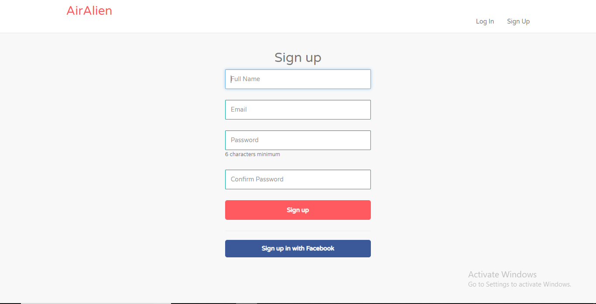
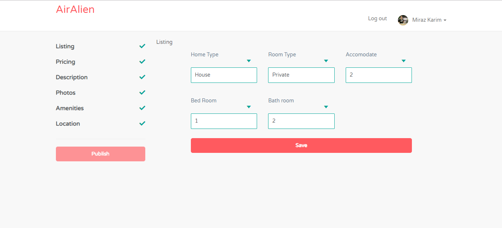
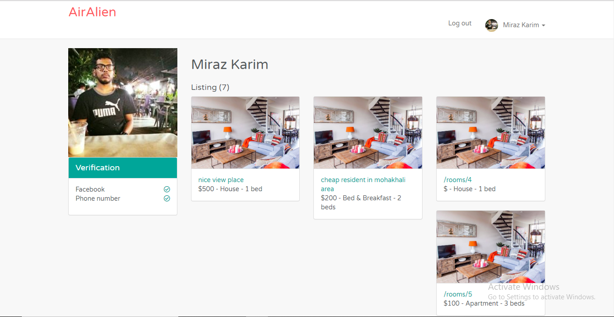
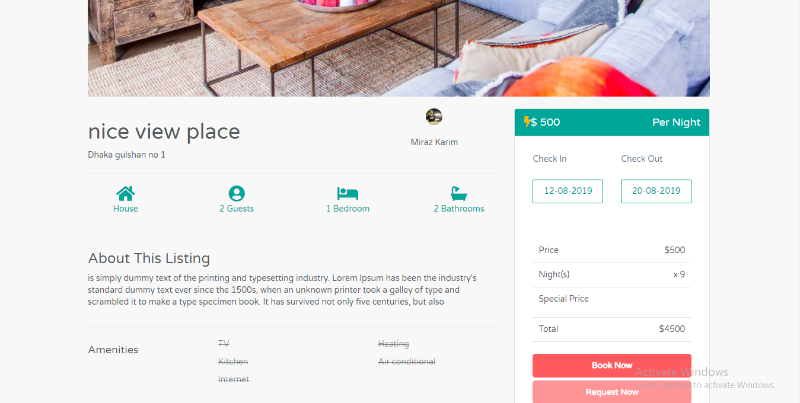
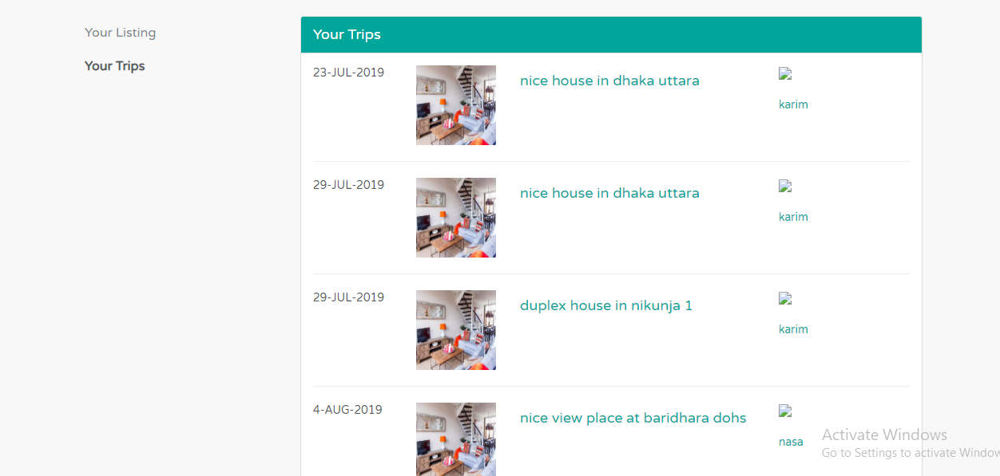

##  AirAlien Demo

## About

 `AirAlien is a platform where hosts people wanting to rent out their property, and travellers, who avail the rented property, can come and meet each other on the platform. Travellers can look up all the listings whenever they like, but in order to book any reservation, they have to create an AirAlien profile. Travellers can contact the hosts by filling in an online form that can be found on every listing page. Once they’ve found the right type of property, they can go ahead and submit the reservation form by clicking ‘Book It.’`

 

## Feature
- `Login feature where people can easily login with their facebook or google account,`

- Signup feature where people can easily signup with their facebook or google account,`

-rental published form feature where people can easily post  with their rental,`

-rental host profie page show their reservations ,`

-rental booking ,`

-rental host profie page show their reservations ,`

-User trip list`

